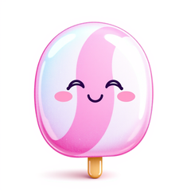
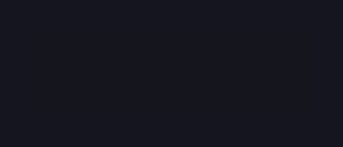

# CandyFreeze

<!-- BADGES:BEGIN -->
[](https://github.com/detain/sugarcraft/actions/workflows/ci.yml)
[](https://app.codecov.io/gh/detain/sugarcraft?flags%5B0%5D=candy-freeze)
[](https://packagist.org/packages/sugarcraft/candy-freeze)
[](LICENSE)
[](https://www.php.net/)
<!-- BADGES:END -->


PHP port of [charmbracelet/freeze](https://github.com/charmbracelet/freeze) —
turn code or terminal output into an SVG screenshot. **No `ext-gd` /
Imagick required**; the output is plain text suitable for git diffs and
CI artifacts.

```sh
composer require sugarcraft/candy-freeze
```

## CLI

```sh
echo "function hello() { return 'world'; }" \
    | candyfreeze --theme dracula --line-numbers > out.svg

candyfreeze input.php \
    --theme tokyo-night --no-window --output screenshot.svg
```

Flags:
- `--theme {dark|light|dracula|tokyo-night|nord}` — colour palette.
- `--padding N` — content padding inside the frame.
- `--no-window` — drop the macOS-style traffic-light controls.
- `--no-shadow` — drop the SVG drop-shadow filter.
- `--no-border` — drop the frame outline.
- `--line-numbers` — render a left-gutter line counter.
- `--border-radius N` — corner radius of the frame.
- `-o`/`--output <path>` — write SVG to a file instead of stdout.

## Library

```php
use SugarCraft\Freeze\SvgRenderer;

$svg = SvgRenderer::dracula()
    ->withLineNumbers(true)
    ->withWindow(true)
    ->withPadding(24)
    ->withLigatures(true)
    ->render($code);

file_put_contents('out.svg', $svg);
```

ANSI input is honoured — SGR foreground colours (16 / 256 / 24-bit truecolor)
plus bold / italic / underline become `<tspan>` segments in the output.
Background colours are rendered as per-segment `<rect>` fills behind the text.

```php
$svg = SvgRenderer::dark()->render("\x1b[31merror:\x1b[0m something broke");

// With background colour
$svg = SvgRenderer::dark()->render("\x1b[44m\x1b[37malert:\x1b[0m background highlight");
```

## Ligatures

Code editors render ligatures (→, >=, !==, etc.) when `font-variant-ligatures: normal` is set. Enable it explicitly:

```php
$svg = SvgRenderer::dracula()
    ->withLigatures(true)
    ->render($code);
```

## Language Detection

`LanguageDetector` provides heuristic detection from content or filename:

```php
use SugarCraft\Freeze\LanguageDetector;

// From content (shebang, then content signatures)
$lang = LanguageDetector::detect($code);        // "php", "bash", "python", ...

// From filename extension
$lang = LanguageDetector::detectFromFilename('script.py');  // "python"
$lang = LanguageDetector::detectFromFilename('foo.php');  // "php"
```

Detection sources (in priority order):
- **Shebang** — `#!/bin/bash`, `#!/usr/bin/env node`, `#!/usr/bin/env php`, etc.
- **Filename extension** — `.php`, `.py`, `.js`, `.rb`, `.sh`, `.sql`, `.html`, `.css`, etc.
- **Content signatures** — language-specific patterns (`namespace `, `<?php`, `def `, `const `, etc.)

Returns `"text"` when no match is found.

## Themes

```php
SvgRenderer::dark();        // charm-ish #0d1117
SvgRenderer::light();       // #f6f8fa
SvgRenderer::dracula();     // #282a36
SvgRenderer::tokyoNight();  // #1a1b26
SvgRenderer::nord();        // #2e3440
```

Build a custom theme via the `Theme` constructor — set background / foreground
/ border / shadow / line-number colour / window-control colours / font family
/ size / line height.

## Demos

### Code screenshot


### ANSI input



## Test

```sh
cd candy-freeze && composer install && vendor/bin/phpunit
```
